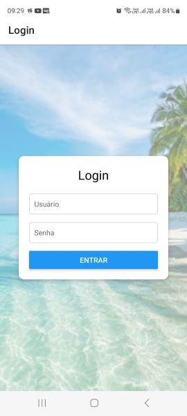
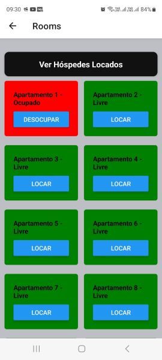
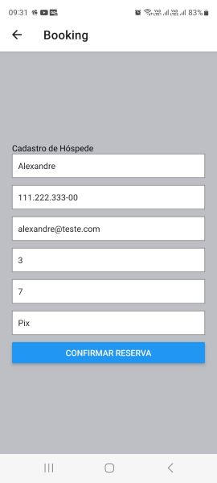
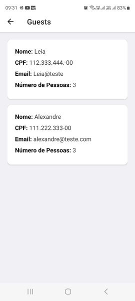

# Gerenciador de Quartos e Hóspedes

Este é um aplicativo móvel desenvolvido em React Native para gerenciar quartos e hóspedes em um sistema de reservas. O aplicativo permite que os usuários se autentiquem, visualizem quartos disponíveis, façam reservas e gerenciem informações sobre hóspedes.

## Funcionalidades

- **Autenticação de Usuário**: Permite que os usuários façam login e logout.
- **Gerenciamento de Quartos**: Visualização de quartos disponíveis e ocupados, com a opção de reservar e desocupar quartos.
- **Gerenciamento de Hóspedes**: Adição e visualização de hóspedes, incluindo informações como nome, CPF e email.
- **Navegação Intuitiva**: Navegação fácil entre as telas de Login, Quartos, Reserva e Hóspedes.
- **Alertas e Notificações**: Confirmação ao desocupar um quarto ocupado.
- **Armazenamento Local**: Utiliza AsyncStorage para armazenar informações sobre quartos e hóspedes.

## Capturas de Tela

Aqui estão algumas capturas de tela do aplicativo:

### Tela de Login


### Tela de Quartos


### Tela de Reservas


### Tela de Hóspedes


## Tecnologias Utilizadas

- **React Native**: Framework para desenvolvimento de aplicativos móveis.
- **React Navigation**: Biblioteca para navegação entre telas.
- **AsyncStorage**: Biblioteca para armazenamento local de dados.

## Pré-requisitos

Antes de executar o aplicativo, você precisa ter o seguinte instalado em sua máquina:

- [Node.js](https://nodejs.org/) (versão 14 ou superior)
- [Expo CLI](https://docs.expo.dev/get-started/installation/) (opcional, mas recomendado para desenvolvimento)
- [Android Studio](https://developer.android.com/studio) ou [Xcode](https://developer.apple.com/xcode/) (para emulação)

## Instalação

1. Clone o repositório:
   ```bash
   git clone https://github.com/AlexandreLiberatto/app-posada.git
   cd app-posada

   Instalar as dependências:

## Início do aplicativo

Inicie o aplicativo com o comando:
```bash
npm start
```

Se estiver usando o Expo, você pode escanear o QR code com o aplicativo Expo Go em seu dispositivo móvel.

## Estrutura do Projeto

```
app-posada/
├── assets/               # Imagens e outros recursos
│   ├── adaptive-icon.jpg
│   ├── apartamentos-disponiveis.jpeg
│   ├── favicon.jpg
│   ├── formulario-de-cadastro.jpeg
│   ├── fundo_login.jpg
│   ├── hospedes-locados.jpeg
│   ├── icon.png
│   ├── login.jpeg
│   └── splash.png
├── src/                  # Código fonte do aplicativo
│   ├── navigation/       # Navegação do aplicativo
│   │   └── AppNavigator.js
│   └── screens/          # Telas do aplicativo
│       ├── BookingScreen.js
│       ├── GuestScreen.js
│       ├── LoginScreen.js
│       └── RoomsScreen.js
├── App.js                # Componente principal do aplicativo
└── package.json          # Dependências e scripts do projeto
```

## Contribuição

Contribuições são bem-vindas! Se você deseja contribuir, siga estas etapas:

1. Fork o projeto.
2. Crie uma nova branch (`git checkout -b feature/nome-da-sua-feature`).
3. Faça suas alterações e commit (`git commit -m 'Adiciona nova feature'`).
4. Envie para o repositório remoto (`git push origin feature/nome-da-sua-feature`).
5. Abra um Pull Request.

## Licença

Este projeto está licenciado sob a [MIT License](LICENSE).

## Contato

Se você tiver alguma dúvida ou sugestão, sinta-se à vontade para entrar em contato:

- **LinkedIn**: [Alexandre Liberato](https://www.linkedin.com/in/alexandre-liberato-32179624b/)
- **GitHub**: [AlexandreLiberatto](https://github.com/AlexandreLiberatto)
- **WhatsApp**: [5548991604054](https://wa.me/5548991604054)
- **Portfólio**: [Portfolio Alexandre Jade](https://portfolio-alexandre-jade.vercel.app/)
